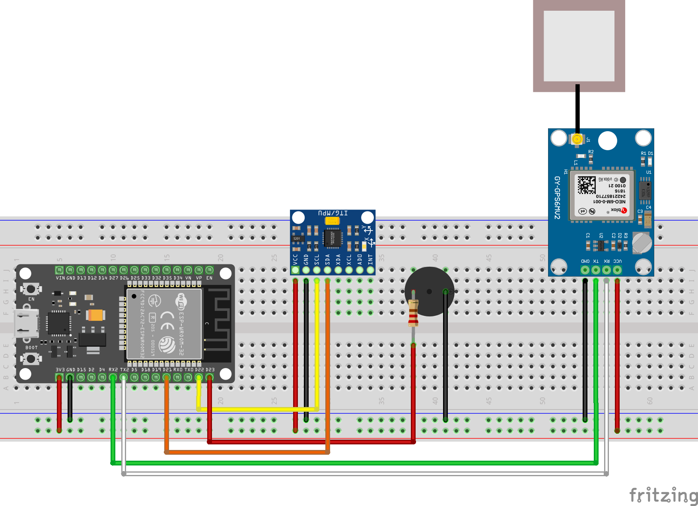

# Sistema IoT de Detecção Automática de Buracos em Vias Urbanas

Este projeto consiste em um protótipo de sistema embarcado baseado em Internet das Coisas (IoT) voltado para o monitoramento passivo e automatizado da infraestrutura viária urbana. O ecossistema foi projetado para capturar anomalias no pavimento (como buracos e crateras) e transmitir os dados de georreferenciamento de forma assíncrona para a nuvem.

A solução está diretamente alinhada ao **Objetivo de Desenvolvimento Sustentável (ODS) 11** da ONU (Cidades e Comunidades Sustentáveis), promovendo a eficiência operacional e a gestão pública orientada a dados (*data-driven*).

## 🔌 Diagrama do Circuito



---

## 📊 Arquitetura do Sistema

O projeto foi desenvolvido utilizando os princípios de **Programação Orientada a Objetos (POO)** na linguagem C++ (framework Arduino), garantindo alta coesão, baixo acoplamento e separação estrita de responsabilidades:

```
├── SmartRoadAlert.ino  # Entry point (Lifecycle Orchestration)
├── Config.ino          # Global Variables, Credentials and Pin Mapping
├── Telemetry.ino       # Sensor Abstraction Layer
└── IotService.ino      # Network Layer, Wi-Fi and MQTT Protocol
```

### Componentes e Conectividade
* **Microcontrolador:** ESP32 DevKit V1.
* **Sensor Inercial:** MPU6050 (Acelerômetro de 3 eixos).
* **Módulo GPS:** NEO-6M (Interface UART Serial2).
* **Interface de Rede:** Protocolo **MQTT** via conexão segura TLS (Porta 8883).
* **Broker Cloud:** **HiveMQ Cloud** (SaaS de mensageria industrial).
* **Feedback Local:** Buzzer Ativo (Pino GPIO 23) atuando com circuito de proteção via resistor.

---

## Como Executar o Projeto

### Pré-requisitos (Software)
Instale as seguintes dependências na sua **Arduino IDE** através do Gerenciador de Bibliotecas:
* `PubSubClient` (por Nick O'Leary)
* `TinyGPS++` (por Mikal Hart)
* `Adafruit MPU6050` e `Adafruit Unified Sensor`

### Configuração
Abra o arquivo `Config.ino` e atualize os parâmetros com as credenciais da sua infraestrutura:

```cpp
const char* const WIFI_SSID = "YOUR_WIFI_SSID";
const char* const WIFI_PASS = "YOUR_WIFI_PASSWORD";

const char* const MQTT_SERVER = "YOUR_CLUSTER.hivemq.cloud";
const char* const MQTT_USER   = "YOUR_HIVEMQ_USER";
const char* const MQTT_PASS   = "YOUR_HIVEMQ_PASSWORD";
```

### Compilação e Deploy
1. Conecte o ESP32 à porta USB.
2. Selecione a placa **DOIT ESP32 DEVKIT V1**.
3. Configure o Serial Monitor para **115200 baud**.
4. Clique em **Upload**.

---

## 📡 Payload de Saída (JSON)

Os dados publicados no tópico MQTT `urban/potholes` seguem a estrutura padronizada em formato JSON:

```json
{
  "latitude": -23.655214,
  "longitude": -46.531245,
  "impact": 19.37
}
```
